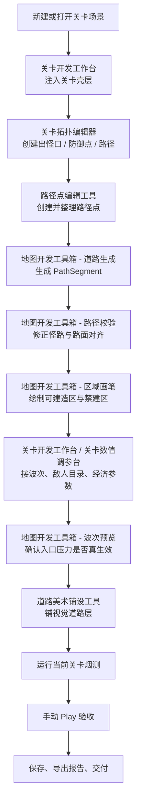
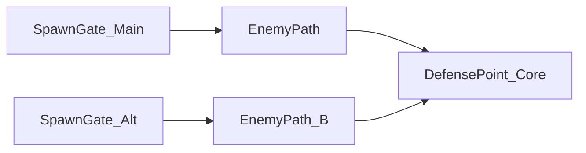
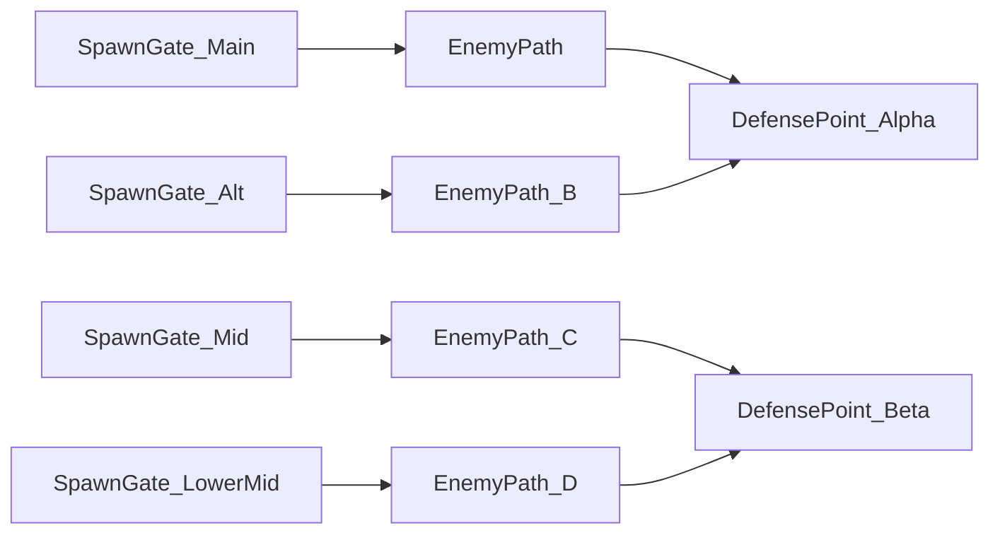
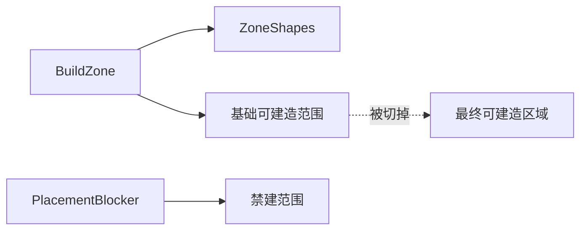
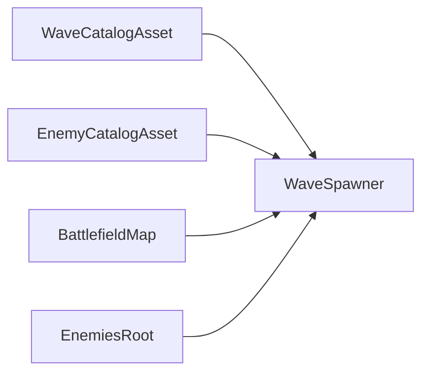
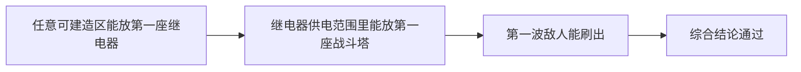

# 塔防地图开发工具链完整关卡制作教程（配图版）

版本：2.0  
更新日期：2026-05-12  
适用项目：`【塔防开发】`  
适用对象：关卡作者、策划、后续接手地图制作的人  
目标：**只使用现有地图开发工具链 + Scene 视图，从 0 到 1 做出一张完整、可运行、可出怪、可放塔、可继续手改的塔防关卡地图**

---

## 0. 这份文档解决什么问题

这不是单纯的“工具按钮说明书”。

它解决的是下面这个实际问题：

> 如果我现在新建一张 Scene，  
> 不想来回翻很多脚本、Prefab、配置资产和 Inspector，  
> 能不能只靠现有地图开发工具链，把它做成一张完整可玩的关卡？

答案是：

**可以，但必须按正确顺序做。**

这份配图版就是把这个顺序拆成一张可以直接照着执行的流程卡。

---

## 1. 开始前先记住 6 条原则

1. **先壳层，后拓扑；先拓扑，后怪路；先功能，后美术。**
2. **不要一开始就调镜头、颜色、装饰边角。**  
   先保证能出怪、能放塔、能通关。
3. **路径点是“怪怎么走”的事实依据。**  
   `PathSegment` 是“地图上哪里算道路”的事实依据。  
   这两个必须对齐。
4. **现在路径点放置有两种模式：**
   - `正交放置`：相邻两个点自动按横平竖直方式连接
   - `随意放置`：相邻两个点允许直接形成斜线段
4. **当前玩法规则是：**
   - 第一座继电器可以放在任意可建造区
   - 战斗塔必须放在继电器供电范围内
5. **一张关卡是否合格，至少要通过 3 个底线检查：**
   - 第一座继电器能放
   - 第一座战斗塔能放
   - 第一波敌人能刷出来
6. **每做完一个阶段就立刻校验。**  
   不要等到全做完才一次性返工。

---

## 2. 整体流程图



---

## 3. 先看“最终要做出来的关卡”长什么样

### 3.1 场景里至少要有这些对象

```text
Scene
├─ Main Camera
├─ HUDCanvas
├─ TowerDefenseGame
├─ WaveSpawner
├─ BattlefieldMap
│  ├─ SpawnGate_Main
│  ├─ SpawnGate_Alt
│  ├─ DefensePoint_Core
│  ├─ EnemyPath
│  │  └─ Waypoints...
│  └─ EnemyPath_B
│     └─ Waypoints...
├─ BuildZone
├─ PlacedTowers
├─ PlacementPreviewRoot
├─ EnemiesRoot
├─ PathSegment_*
└─ 其他美术 / 装饰 / 禁建区对象
```

### 3.2 这张图至少要满足这条链


只要这条链断一环，就不算“完整可玩关卡”。

---

## 4. 你会用到的工具

### 4.1 关卡开发工作台

菜单：

`Tools > Tower Defense > Authoring > 关卡开发工作台`

它负责：

- 注入关卡壳层
- 接管当前场景上下文
- 修改最常用场景参数
- 打开其他专项工具
- 运行当前关卡烟测

### 4.2 路径点编辑工具

菜单：

`Tools > Tower Defense > Authoring > 路径点编辑工具`

它负责：

- 创建路径点
- 收集路径点
- 排序、插点、交换、追加路径点

### 4.3 地图开发工具箱

菜单：

`Tools > Tower Defense > Authoring > 地图开发工具箱`

页签：

- 路径校验
- 道路生成
- 模板同步
- 健康检查
- 区域画笔
- 波次预览

### 4.4 关卡拓扑编辑器

菜单：

`Tools > Tower Defense > Authoring > 关卡拓扑编辑器`

它负责：

- 管理 `SpawnGate`
- 管理 `DefensePoint`
- 管理 `EnemyPath`
- 管理它们之间的接线关系

### 4.5 道路美术铺设工具

菜单：

`Tools > Tower Defense > Authoring > 道路美术铺设工具`

它负责：

- 给已经正确的功能道路铺一层独立的视觉道路层

它**不负责**：

- 怪物路径逻辑
- 功能碰撞
- 禁建逻辑

### 4.6 关卡数值调参台

菜单：

`Tools > Tower Defense > Authoring > 关卡数值调参台`

它负责：

- 开局废料
- 基地生命
- 建造成本
- 继电器上限
- 波次参数
- 塔原型参数
- 敌人目录参数

### 4.7 运行当前关卡烟测

入口 1：

`Tools > Tower Defense > Validation > 运行当前关卡烟测`

入口 2：

`关卡开发工作台 > 运行态烟测`

它负责检查：

- 第一座继电器能不能放
- 放下继电器后第一座战斗塔能不能放
- 第一波敌人能不能刷出来

---

# 第一阶段：起壳层

## 5. 先新建或打开关卡场景

### 情况 A：你已经有一张空场景

直接打开。

### 情况 B：你还没有场景

在 `Assets/Scenes/` 下新建。

推荐命名：

- `Level06`
- `Challenge01`
- `Prototype_ConvoyDefense`

不要用：

- `New Scene`
- `SampleScene Copy`

---

## 6. 打开关卡开发工作台并接管当前场景

1. 打开 `关卡开发工作台`
2. 点击 `接管当前场景`

你现在应该能看到：

- 当前场景名
- 当前地图入口
- 当前刷怪器

如果这一步失败，不要往下走，先确认你是不是打开了正确的 Scene。

---

## 7. 注入关卡壳层

在 `关卡壳层创建器` 分区里，有两个入口：

```text
关卡壳层创建器
├─ 把当前场景初始化成关卡壳层
└─ 新建空白关卡场景并注入壳层
```

### 推荐做法

- 已经有空场景：  
  点 `把当前场景初始化成关卡壳层`

- 想连场景一起自动建：  
  点 `新建空白关卡场景并注入壳层`

### 成功后至少要出现

```text
├─ Main Camera
├─ HUDCanvas
├─ TowerDefenseGame
├─ WaveSpawner
├─ BattlefieldMap
├─ BuildZone
├─ PlacedTowers
├─ PlacementPreviewRoot
└─ EnemiesRoot
```

如果这些对象没齐，不要继续做路线。

---

## 8. 壳层注入后，再接管一次上下文

再次点：

- `接管当前场景`

现在工作台里至少应该已经能抓到：

- 总控
- 刷怪器
- 地图入口
- 可建造区
- 主相机

这一步很重要，因为后面的工具都建立在“当前上下文已经接对”的前提上。

---

# 第二阶段：先定拓扑，不要急着画路

## 9. 先决定这关到底是怎么打的

你要先回答 3 个问题：

1. 这关有几个出怪口？
2. 这关有几个防御点？
3. 每个出怪口最终打哪个防御点？

### 单核图示意



### 双核图示意



---

## 10. 用关卡拓扑编辑器创建结构

顺序建议固定成：

1. 创建所有 `SpawnGate`
2. 创建所有 `DefensePoint`
3. 创建所有 `EnemyPath`
4. 给每个 `SpawnGate` 接好：
   - `EnemyPath`
   - `DefensePoint`

### 推荐命名

出怪口：

- `SpawnGate_Main`
- `SpawnGate_Alt`
- `SpawnGate_Mid`
- `SpawnGate_LowerMid`

防御点：

- `DefensePoint_Core`
- `DefensePoint_Alpha`
- `DefensePoint_Beta`

路径：

- `EnemyPath`
- `EnemyPath_B`
- `EnemyPath_C`
- `EnemyPath_D`

---

# 第三阶段：创建怪路

## 11. 打开路径点编辑工具

先在 Hierarchy 里选中你要编辑的那条 `EnemyPath`，再打开工具。

第一眼先确认：

```text
当前路径 = 你正在做的那条 EnemyPath
```

如果当前路径不对，后面的放点和排序都会错。

---

## 12. 用 Scene 点击放点模式创建路径点

最推荐的放点方式就是：

- `开启 Scene 点击放点模式`

### 路径示意

```text
Gate ---- 点1 ---- 点2
                  |
                  |
                 点3 ---- 点4 ---- DefensePoint
```

### 实际步骤

1. 开启 `Scene 点击放点模式`
2. 回到 Scene 视图
3. 沿怪物应走的中心线逐个点击
4. 每个明显拐角都单独放一个点
5. 按 `Esc` 退出

### 放点原则

#### 正交放置
- 直线段可以少点
- 拐角一定补点
- 工具会自动把相邻放点收成横平竖直关系

#### 随意放置
- 可以直接做斜线段
- 适合本来就不是棋盘式道路的地图
- 但仍要保证视觉道路层和功能道路层都能跟上

示意：

```text
正交放置：
A ---- B
      |
      |
      C

随意放置：
A
 \ 
  \
   B
```

---

## 13. 整理路径点顺序

放出来的点不代表顺序一定已经正确。

### 最常用流程

1. 在 Scene 里选中这批点
2. 回到 `路径点编辑工具`
3. 看 `收集当前选中点`
4. 选择排序方式
5. 再决定是：
   - `用选中点替换当前路径`
   - 或 `把选中点追加到当前路径`

### 排序方式怎么选

```text
HierarchyOrder   -> 你已经自己整理过层级
LeftToRight      -> 路线主要向右推进
TopToBottom      -> 路线主要向下推进
NearestChain     -> 点位已经摆得大致正确，但路线弯折较多
```

### 放点模式怎么选

```text
正交放置 -> 地图主要由横平竖直道路构成
随意放置 -> 地图允许斜线段、斜坡感、自由折线
```

---

## 14. 路径顺序错了怎么快速修

不要整条重做，优先用这些微修按钮：

- `交换两个已选路径点`
- `把激活点插到另一个点后面`
- `已选点插到当前点后面`
- `已选点插到末尾`

### 典型情况

#### 两个点顺序反了

```text
原本应该：
1 -> 2 -> 3 -> 4

结果变成：
1 -> 3 -> 2 -> 4
```

做法：

- 选中 `2` 和 `3`
- 点 `交换两个已选路径点`

#### 补的新点应该插在中间

做法：

- 选中新点
- 再选中“它前面的旧点”
- 点 `已选点插到当前点后面`

#### 新点应该挂到尾巴上

做法：

- 选中新点
- 点 `已选点插到末尾`

---

# 第四阶段：生成功能道路

## 15. 打开地图开发工具箱，切到“道路生成”

路径点只是逻辑路线。

真正让系统知道：

- 哪些地方算路
- 哪些地方禁建
- 哪些地方需要功能碰撞

靠的是：

- `PathSegment`

### 生成后应该出现

```text
PathSegment_01
PathSegment_02
PathSegment_03
...
```

而且每段至少有：

- `BoxCollider2D`
- `PlacementBlocker`

如果没有，就说明道路还只是“看起来像做了”，并没有真正接入玩法。

---

## 16. 生成后立刻做路径校验

不要生成完就直接做美术。

先切到：

- `路径校验`

### 推荐顺序

1. 先校验当前选中路径
2. 再校验整张图全部路径

### 你要重点看这些问题

- 路径点偏离路面
- 路径段缺少路面覆盖
- 出怪口未贴合首个路径点

补充：

- 在 `正交放置` 模式下，出现斜线通常意味着你应该补拐角点
- 在 `随意放置` 模式下，斜线本身是允许的，重点应转成检查“路面覆盖是否跟上”

### 自动修正什么时候用

可以用：

- 路径点只是轻微偏离
- 某个拐角只是局部不顺

不建议直接用：

- 整条路线结构本身错了
- 你打算换一套完全不同的走法

那种情况应该回到“路径点阶段”重做。

---

# 第五阶段：画可建造区与禁建区

## 17. 先理解建造区结构

在这个项目里，玩家不是“看到空地就一定能建”。

真正决定能不能建的是：

- `BuildZone`
- `ZoneShape`
- `PlacementBlocker`

### 逻辑关系



---

## 18. 用区域画笔画可建造区

在 `地图开发工具箱 > 区域画笔`：

1. 选择 `BuildZoneShape`
2. 在 Scene 里拖矩形

### 推荐思路

不要只画一整块超级大平地。

更推荐画成几个“空地岛”：

```text
空地岛 A   空地岛 B

      路

空地岛 C        空地岛 D
```

这样后面布塔会更有取舍。

---

## 19. 再画禁建区

还是在 `区域画笔`：

1. 切到 `PlacementBlocker`
2. 在这些地方拖框：
   - 路面
   - 建筑
   - 明确不允许建造的装饰区

### 这一步完成后你应该看到

```text
BuildZone
└─ ZoneShape_*

PlacementBlocker_*
PlacementBlocker_*
PlacementBlocker_*
```

如果只是画出了可视对象，但 `BuildZone` 没收进去，这一步仍然不算完成。

---

# 第六阶段：接波次、敌人和经济参数

## 20. 地图骨架成型后尽快接第一波

不要等地图全做完才接波次。

更稳的是：

- 路线和建造区大致成型后
- 就尽快接第一波

因为很多“整关根本不跑”的问题，都是在这一步暴露的。

---

## 21. 在工作台里接波次链

回到：

- `关卡开发工作台 > 波次与刷怪参数`

接这些引用：

- `waveCatalogAsset`
- `enemyCatalogAsset`
- `enemyPrototypeReference`
- `enemyRootReference`
- `battlefieldMapReference`

### 结构图



---

## 22. 用关卡数值调参台做第一轮平衡

打开：

- `关卡数值调参台`

先套一个：

- `简单`
- `标准`
- `困难`

建议新图初稿先用：

- `标准`

然后再微调：

- 开局废料
- 基地生命
- 建造成本
- 继电器上限
- 波次强度

---

## 23. 用波次预览确认“多入口是真的在工作”

回到：

- `地图开发工具箱 > 波次预览`

重点看：

- 每波总敌人数
- 每波总废料
- 出怪口分配

你真正想确认的是：

```text
这关有 3 个入口，
是不是实际只用了 1 个？

这关有 2 个防守点，
是不是所有压力都只打同一个点？
```

---

# 第七阶段：铺道路美术层

## 24. 什么时候开始铺美术

顺序一定是：

```text
先功能正确
再视觉铺设
```

也就是至少先确认：

- 怪路不偏
- 能出怪
- 能放塔

再去做 `RoadArt`

---

## 25. 道路美术铺设工具在这条链里的职责

它负责：

- 让路“看起来像正式道路”

它不负责：

- 替代怪路
- 替代功能路段
- 替代禁建逻辑

### 三者关系

```text
EnemyPath   -> 怪怎么走（可正交，也可斜线）
PathSegment -> 哪些地方算功能道路
RoadArt     -> 路看起来像什么
```

---

# 第八阶段：跑健康检查

## 26. 至少跑 3 次

建议在下面 3 个节点各跑一次：

1. 路线和道路做完后
2. 建造区做完后
3. 波次接完后

### 你最关心的红旗问题

- 缺 `BuildZone`
- 缺 `SpawnGate`
- 缺 `DefensePoint`
- 路径点不在路面上
- 出怪口不在首个路径点上
- 防守点不在最终路段上

---

## 27. 导出关卡报告什么时候最有用

如果你要：

- 把关卡交给别人继续调
- 和策划讨论强度
- 对比几张关卡的规模差异

就导出：

- `Level Design Report`

---

# 第九阶段：运行态烟测

## 28. 烟测最推荐的入口

不是菜单，而是：

```text
关卡开发工作台
└─ 运行态烟测
   ├─ 运行当前关卡烟测
   ├─ 刷新烟测结果
   └─ 复制报告路径
```

---

## 29. 烟测会检查什么



### 你希望看到的最低通过结果

```text
继电器放置：成功
单体塔放置：成功
首只敌人刷出：成功
综合结论：通过
```

只要这 3 项有一项失败，就先修玩法结构，不要继续堆美术。

---

# 第十阶段：手动 Play 最终验收

## 30. 为什么烟测通过后还要 Play

因为烟测只回答：

- 最低限度能不能跑

但不会替你判断：

- 路看起来顺不顺
- 战区是不是太挤
- UI 有没有压住关键路线
- 实际手感是不是别扭

---

## 31. 手动验收时至少看这 5 件事

1. 第一座继电器能不能在任意可建造区放下
2. 战斗塔是否仍然必须在供电范围内
3. 第一波怪是否沿设计路线移动
4. 怪路和路面视觉是否重合
5. HUD 是否挡住关键战斗区

---

# 第十一阶段：最终交付清单

## 32. 交付前逐项打勾

- [ ] 关卡壳层完整
- [ ] 出怪口已接好
- [ ] 防御点已接好
- [ ] 每条路径有足够路径点
- [ ] 功能道路已生成
- [ ] 怪路与路面对齐
- [ ] 可建造区已生效
- [ ] 禁建区已处理
- [ ] 波次与敌人目录已接好
- [ ] 第一座继电器能放
- [ ] 第一座战斗塔能放
- [ ] 第一波敌人能刷
- [ ] 手动 Play 没有明显错位或遮挡问题

只要这张清单勾完，这张图就已经达到“完整可游玩”的标准。

---

## 33. 最后给你的实用建议

### 不要这样做

- 先铺满美术再去查怪路
- 一边大改路径一边大改波次
- 不跑烟测就直接认定关卡完成

### 更稳的做法

```text
做一步
校验一步
能跑再往下走
```

这比最后一次性返工整张图轻松得多。

---

## 34. 个人标准流程建议

后面如果你要把它变成你自己的固定做图流程，最推荐就是：

1. 工作台起壳层
2. 拓扑编辑器定结构
3. 路径点工具放怪路
4. 工具箱生成功能道路
5. 工具箱画建造区
6. 调参台接波次和敌人
7. 工具箱做预览与检查
8. 工作台做烟测
9. 道路工具铺美术
10. Play 最终确认

一旦你按这个顺序做熟了，后面再做新关卡会快很多。
